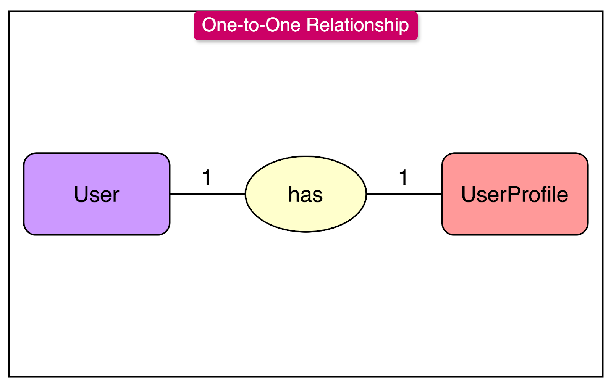
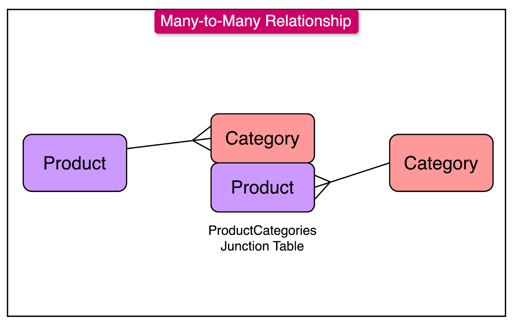

# Database Relationships

## Definition of a Database Relationship

A database relationship is a logical connection between two or more tables using Primary Keys and Foreign Keys. This relationship allows data to be stored in separate tables without duplication while still being able to retrieve related information using queries and joins.

In real-world applications like an e-commerce system, storing all data in a single table leads to redundancy, data inconsistency, and difficulty in maintenance. Relational databases solve this problem by dividing data into multiple tables and connecting them using relationships.

---

## Types of Database Relationships

There are three main types of relationships in relational databases:

1. One-to-One (1:1)
2. One-to-Many (1:M)
3. Many-to-Many (M:M)

These relationships can be clearly understood using examples from an e-commerce application.

---

## One-to-One Relationship (1:1)

In a One-to-One relationship, one record in a table is related to only one record in another table and vice versa.

### E-Commerce Example

In an e-commerce website, each user has exactly one user profile that stores additional details such as address and phone number.

Tables involved:
- users
- user_profiles

The user_profiles table contains a foreign key user_id that references the id in the users table. This ensures that each user can have only one profile and each profile belongs to only one user.

---

## One-to-Many Relationship (1:M)

In a One-to-Many relationship, one record in a table can be related to many records in another table.

### E-Commerce Example

One user can place many orders, but each order belongs to only one user.

Tables involved:
- users (parent table)
- orders (child table)

The orders table contains a foreign key user_id referencing the users table. The database will not allow an order to exist without a valid user, which maintains data integrity.

---

## Many-to-Many Relationship (M:M)

In a Many-to-Many relationship, many records in one table are related to many records in another table. This type of relationship requires a junction table to connect both tables.

### E-Commerce Example

A product can belong to multiple categories, and a category can contain multiple products.

Tables involved:
- products
- categories
- product_categories (junction table)

The product_categories table contains two foreign keys: product_id and category_id. These keys connect products and categories and establish the many-to-many relationship.

