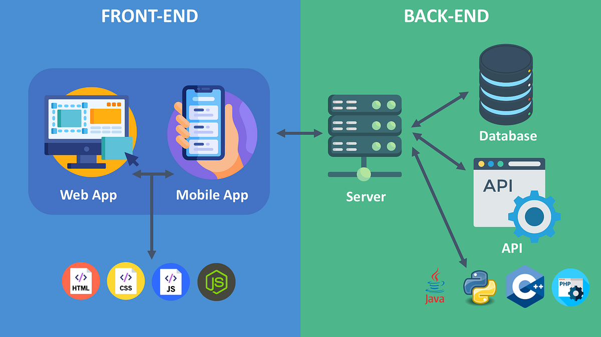
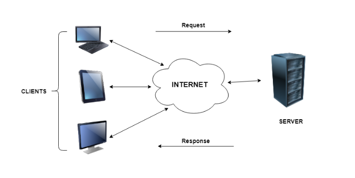

# Introduction to Backend Development & Node.js – Answers

---

## Q1. Role of Frontend (FE)

Frontend is the part of a web application that users directly interact with through their browser. It focuses on how the application looks and how users interact with it.

### User Interface  
The frontend is responsible for displaying visual elements such as buttons, forms, text, images, and layouts. It ensures the application is user-friendly, responsive, and visually clear on different devices.

### User Interaction  
Frontend handles user actions like clicking buttons, entering data in forms, navigating between pages, and receiving instant feedback such as validation messages or alerts. JavaScript is mainly used to manage these interactions.

### Communication with Backend  
The frontend communicates with the backend using APIs, usually through HTTP requests. For example, when a user logs in or submits a form, the frontend sends the data to the backend and displays the response received.

---

## Q2. Role of Backend (BE)

Backend is the server-side part of a web application that handles logic, data, and security. It works behind the scenes and is not directly visible to users.

### Server-Side Processing  
The backend processes requests coming from the frontend, applies required logic, and prepares appropriate responses.

### Database Handling  
Backend interacts with databases to store, retrieve, update, and delete data. Examples include saving user information, fetching product details, or updating records.

### Security and Authentication  
Backend ensures application security by managing authentication, authorization, password encryption, and access control. It protects sensitive data from unauthorized access.

---

## Q3. Business Logic

Business Logic refers to the rules and decision-making processes that define how a web application behaves according to real-world requirements. It acts as a bridge between the frontend and the database.

Business logic controls validations, permissions, workflows, and conditions that must be followed for the system to function correctly.

### Real-world examples:

1. **E-commerce Application:**  
   Applying discount coupons only when the cart value exceeds a specific amount and the coupon is valid.

2. **Banking Application:**  
   Blocking money transfers if the account balance is insufficient or if the daily transaction limit is exceeded.

3. **Online Examination System:**  
   Automatically submitting the exam when the time limit ends and preventing multiple attempts beyond the allowed count.

---

## Q4. Client–Server Model

The Client–Server Model is a system where responsibilities are divided between clients that request services and servers that provide those services.

### Client  
The client is usually a web browser or mobile application that sends requests and displays responses to the user.

### Server  
The server processes client requests, applies logic, interacts with the database, and sends responses back to the client.

### Communication  
Communication happens over a network using protocols such as HTTP. The client sends a request, the server processes it, and then returns a response.

---

## Q5. Three-Tier Architecture

Three-Tier Architecture divides a web application into three separate layers to improve organization, scalability, and maintenance.

### Presentation Layer  
This layer includes the frontend and is responsible for displaying data and handling user interactions.

### Application (Business) Layer  
This layer contains the business logic and processes requests received from the presentation layer.

### Data Layer  
This layer manages the database and handles data storage and retrieval.
 
This architecture is used because it separates concerns, improves security, allows easier maintenance, and enables independent scaling of each layer.

---

## Q6. JavaScript as a Backend Language

JavaScript is widely used as a backend language due to its efficiency and strong ecosystem.

### Performance  
With Node.js, JavaScript uses an event-driven and non-blocking architecture, making it efficient for handling multiple concurrent requests.

### Ecosystem  
JavaScript has a large ecosystem supported by npm, which provides thousands of libraries and tools for backend development.

### Popular Backend Frameworks  
Frameworks such as Express.js, NestJS, and Fastify simplify backend development and are commonly used in real-world applications.

Using JavaScript for both frontend and backend also helps in faster development and better code consistency.

---
